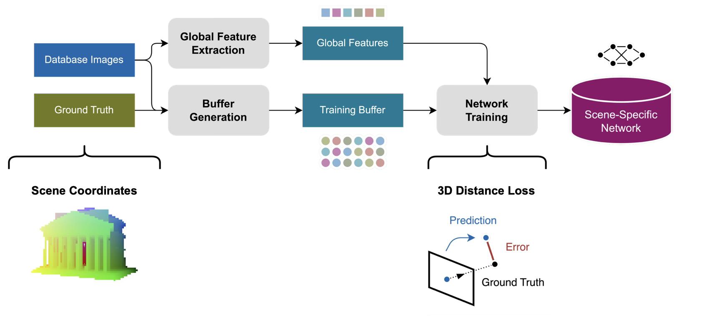
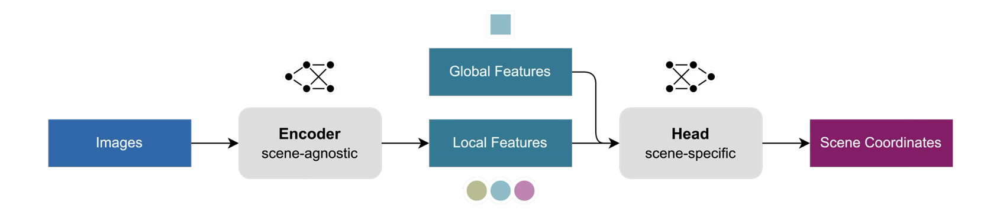
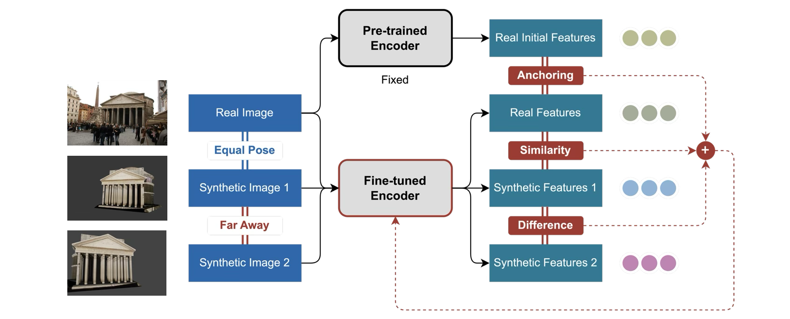
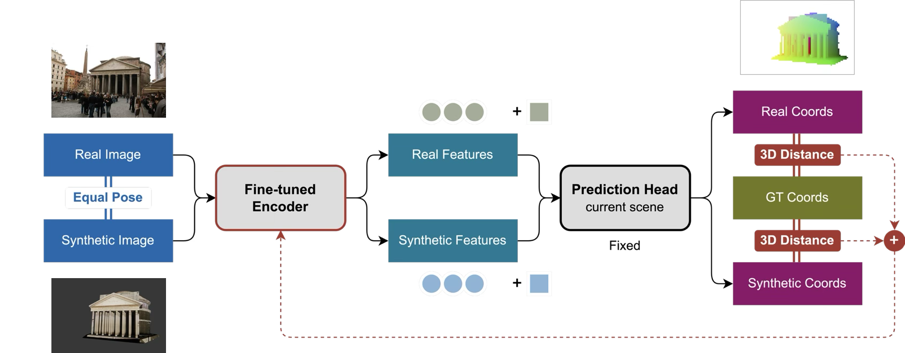

# GLACE-3D: Scene Coordinate Regression using 3D Models

[](https://www.python.org/downloads/) [](https://pytorch.org/) [](https://opensource.org/licenses/MIT)

Adaptation of scene coordinate regression (specifically [GLACE](https://github.com/cvg/glace)) for localization against 3D models – training on synthetic data and testing on real data. This repository implements:

1. A supervised 3D loss function to make effective use of the available 3D scene coordinates
2. Transfer learning to bridge the domain gap between synthetic and real data
3. (Associated features for training and evaluation)

This repository is part of my [Master Thesis](https://github.com/erictubo/Master-Thesis) about visual localization against 3D models (see project page for report and presentation). The first component is [3D-Localization](https://github.com/erictubo/3d-localization), a separate repository that generates synthetic training data by rendering CAD models in Blender.

### Contents

1. [Visual Overview](#1-visual-overview)
2. [Installation](#2-installation)
3. [Datasets](#3-datasets)
4. [Usage](#4-usage)
    - [Global Features](#global-features)
    - [Training](#training)
    - [Evaluation](#evaluation)
    - [Transfer Learning](#transfer-learning)
    - [End-to-End Training](#end-to-end-training)
5. [File Structure](#5-file-structure)
6. [Updates Compared to GLACE](#6-updates-compared-to-glace)
7. [Acknowledgments](#7-acknowledgments)

## 1. Visual Overview

### Supervised Training against Scene Coordinates



### Transfer Learning for Domain Adaptation

**Inference Process:**
Predict pixel-wise 3D scene coordinates using a scene-agnostic feature encoder and a scene-specific regression head.



The encoder is pre-trained on real images only, and needs to be fine-tuned for synthetic images to achieve invariance between real and synthetic features.

**Fine-tuning using Features**

Loss function terms include Anchoring (limit changes of real features), Similarity (achieve domain adaptation), and Difference (promote spatial distinctiveness).



**Fine-tuning against Scene Coordinates**

3D distance loss of real and synthetic scene coordinates against ground truth.



## 2. Installation

Install dependencies:

```shell
pip install -r requirements.txt
```

Install the C++/Python bindings of the DSAC* functions:

```shell
cd dsacstar
python setup.py install
```

## 3. Datasets

GLACE-3D is designed to work with real data (like GLACE) and synthetic data (generated/converted using [3D-Localization](https://github.com/erictubo/3d-localization)).

For quick setup with selected published datasets (real image reconstructions), including 7/12-Scenes, Cambridge Landmarks, and Aachen Day-Night, refer to the [GLACE](https://github.com/cvg/glace) documentation.

For working with both real and synthetic data for one dataset, including generating synthetic data from CAD models and converting real image reconstructions to the GLACE format, follow the instructions in the [3D-Localization](https://github.com/erictubo/3d-localization) repository.

### Data Format

The data format follows GLACE/ACE/DSAC* conventions:

```
<scene_path>/
├── train/
│   ├── calibration/*.txt    # Camera intrinsics (matrix)
│   ├── depth/*.npy          # Depth maps
│   ├── init/*.dat           # Initialization targets (sparse MVS)
│   ├── poses/*.txt          # Camera poses (matrix)
│   └── rgb/*.png            # Rendered images
└── test/
    └── ...
```

## 4. Usage

### Global Features

Download pre-trained R2Former checkpoint [CVPR23_DeitS_Rerank.pth](https://drive.google.com/file/d/1RU4wnupKXpmM0FiPeglqeNizBw4w6j38).

Extract global features for all the images in the dataset:

```shell
cd datasets
python extract_features.py <scene path> --checkpoint <path to the R2Former checkpoint>
```

### Training

Train scene-specific regression head using the `train_ace.py` script:

```shell

torchrun --standalone --nnodes <num nodes> --nproc-per-node <num gpus per node> \
  ./train_ace.py <scene path> <output map name> \
  --num_head_blocks <num_head_blocks> \
  --training_buffer_size <training_buffer_size> \
  --max_iterations <max_iterations> \
  --checkpoint_path <checkpoint path> \
  --checkpoint_interval <checkpoint_interval> \
  --mode <mode> \
  --sparse <sparse> \
  --switch_iterations <switch_iterations>

# Example:
torchrun --standalone --nnodes 1 --nproc-per-node 1 \
  ./train_ace.py 'datasets/Cambridge_KingsCollege' 'output/Cambridge_KingsCollege.pt' \
  --num_head_blocks 2 \
  --training_buffer_size 4000000 \
  --max_iterations 30000 \
  --checkpoint_path 'output/checkpoint/Cambridge_KingsCollege.pt' \
  --checkpoint_interval 5000 \
  --mode 0 \
  # --sparse True \
  # --switch_iterations 10000

```

Relevant options from GLACE:

* `--num_head_blocks` specifies the size of the regression head: use 2 for medium-sized datasets (GLACE uses N=1 for 7Scenes and 12Scenes, N=2 for Cambridge Landmarks, and N=3 + other settings for Aachen - see paper).
* `--training_buffer_size` changes the size of the training buffer to fit on GPU memory (default 16M, used 4M to fit on 8GB GPU).
* `--max_iterations` changes the number of training iterations (default 30K).

New options (not in GLACE):

- Loss function:
  - `--mode` changes the loss function (0 for reprojection loss, 1 for supervised 3D loss).
  - `--switch_iterations` only for mode 1: after how many iterations to switch from mode 1 (supervised 3D loss) to mode 0 (reprojection loss).
  - `--sparse` only for mode 1: set True for MVS model, False for dense mesh - will either use sparse MVS initialization targets or dense depth maps.
- Checkpoints:
  - `--checkpoint_interval` specifies the iterations interval at which to save checkpoints (default 5K).
  - `--checkpoint_path` specifies the path where to save checkpoints during training to avoid data loss and resume training later.

Run `train_ace.py --help` for more details or see the `train_ace.py` script for options and defaults.

> **Note:** Automatic training and testing scripts are available in the `/scripts` folder, making it easier to run experiments with different datasets and/or settings.

### Evaluation

Test localization using the `test_ace.py` script:

```shell
./test_ace.py <scene path> <output map name> \
  --test_log_file <test log file> \
  --pose_log_file <pose log file>

# Example:
./test_ace.py 'datasets/Cambridge_KingsCollege' 'output/Cambridge_KingsCollege.pt' \
  --test_log_file 'eval/test_log_Cambridge_KingsCollege.txt' \
  --pose_log_file 'eval/pose_log_Cambridge_KingsCollege.txt'
```

- `test_log_file` saves the test results (accuracy metrics).
- `pose_log_file` saves the estimated poses.

Alternatively, use the `test_ace_coords.py` script to evaluate scene coordinates against available ground truth (instead of poses after PnP/RANSAC):

```shell
./test_ace_coords.py <scene path> <output map name> \
  --eval_path <evaluation path>
```

> **Note:** Automatic training and testing scripts are available in the `/scripts` folder, making it easier to run experiments with different datasets and/or settings.

### Transfer Learning

Set options directly in the [encoder_trainer.py](encoder_trainer.py) code, at the bottom in the `if __name__ == '__main__':` block.

Options:

- **Data \& augmentation:**
  - `use_half`: default `True`
  - `image_height`: default `480`
  - `aug_rotation`: default `40` [deg]
  - `aug_scale_min`: default `240/480`
  - `aug_scale_max`: default `960/480`

- **Input:**
  - `encoder_path`: path to pre-trained encoder
  - `data_path`: specifies the path to the dataset.
  - `dataset_names`: list of dataset names = folders in data_path
  - `val_dataset_name`: validation dataset name, in dataset_names
  - `head_paths`: dictionary of scene-specific head paths = {dataset_name: head_path, ...}

- **Output:**
  - `experiment_name`: name of the experiment for Tensorboard logging
  - `output_path`: path to save encoder

- **Training parameters:**
  - `batch_size`
  - `num_epochs`
  - `max_iterations`
  - `gradient_accumulation_samples`: samples to accumulate before update
  - `validation_frequency`: number of updates before regular validation
  - `iter_val_limit`: sample limit for regular validation (during epoch)
  - `epoch_val_limit`: sample limit for epoch validation
  - `learning_rate`
  - `clip_norm`: gradient clipping value

- **Loss functions:**
  - `loss_function`: `separate` / `combined` - fine-tune encoder for synthetic data only and use pre-trained encoder for real data / fine-tune encoder for both synthetic and real data
  - Scene coordinates
    - `use_coords`: `loss`/ `track`
    - `median`: `True` / `False`
    - `coords_scale`: scale factor for scene coordinates in loss
  - Features
    - `use_cosine`: `loss` / `track`
    - `cosine_weights`: weights for cosine loss
      - Separate: 2 weights [similarity, difference]
      - Combined: 3 weights [similarity, difference, anchor]
    - `use_magnitude`: `loss` / `track`

See [encoder_trainer.py](encoder_trainer.py) for more details (scroll to the bottom).

### End-to-End Training

Configure end-to-end training in [encoder_trainer_e2e.py](encoder_trainer_e2e.py).

> **Note:** Command-line interface for end-to-end training coming soon.

Options similar to above, only differences:

- Currently, only one dataset (head) is supported: `head_path` instead of `head_paths` dictionary
- Most loss function options are irrelevant since training against 3D coordinates exclusively, only:
  - `loss_function`: `separate` / `combined` - fine-tune encoder for synthetic data only and use pre-trained 
  - `median`: `True` / `False`
  - (features cosine loss and magnitude commented out but can be activated for tracking purposes)

## 5. File Structure

```
glace-3d/
├── ace_*.py                 # Core GLACE components
├── encoder_*.py             # Transfer learning components
├── train_*.py               # Training scripts
├── test_*.py                # Evaluation scripts
├── dataset.py               # Dataset handling
├── dsacstar/                # C++/Python bindings
├── datasets/                # Dataset setup scripts
├── scripts/                 # Automated training scripts
├── requirements.txt         # Python dependencies
└── README.md               # This file
```

### Key Files

| File | Purpose |
|------|---------|
| [ace_network.py](ace_network.py) | Network architecture definition |
| [ace_trainer.py](ace_trainer.py) | Scene-specific training pipeline |
| [encoder_trainer.py](encoder_trainer.py) | Transfer learning pipeline |
| [encoder_trainer_e2e.py](encoder_trainer_e2e.py) | End-to-end training pipeline |
| [train_ace.py](train_ace.py) | Training script interface |
| [test_ace.py](test_ace.py) | Evaluation script interface |
| [test_ace_coords.py](test_ace_coords.py) | Evaluation script interface for scene coordinates |
| [dataset.py](dataset.py) | Dataset loading and processing |

## 6. Updates Compared to GLACE

### Enhanced Features

| Feature | GLACE | GLACE-3D |
|---------|-------|----------|
| Loss Functions | Reprojection only | + Supervised 3D loss |
| Training Modes | Single mode | + Mode switching |
| Transfer Learning | Not supported | Full pipeline |
| End-to-End Training | Not supported | Available |
| Checkpointing | Basic | Advanced with resume |
| Evaluation | Pose-based only | + Coordinate-based |
| Synthetic Data | Not supported | Full integration |

### Modified Files

| File | Changes |
| --- | --- |
| [ace_network.py](ace_network.py) | Added method to build only head network from state dict (used by encoder transfer learning) |
| [ace_trainer.py](ace_trainer.py) | Implemented supervised 3D loss (mode 1) by adding GT scene coordinates to dataloader, option to switch between modes (1 to 0), added saving/loading checkpoints |
| [dataset.py](dataset.py) | Activated scene coordinates; compatibility with numpy depth maps, support for single focal length fx=fy |
| [train_ace.py](train_ace.py) | Added new options according to changes in [ace_trainer.py](ace_trainer.py): mode (0, 1), switch_iterations, sparse (for mode 1, MVS model: True, dense mesh: False), checkpoint_path, checkpoint_interval |
| [test_ace.py](test_ace.py) | Added logging paths as input arguments, fixed OpenCV issue by switching to Scipy Rotation |

### New Files

| File | Description |
| --- | --- |
| [test_ace_coords.py](test_ace_coords.py) | Testing script to evaluate scene coordinates against available ground truth, rather than poses after PnP/RANSAC as in [test_ace.py](test_ace.py) |
| [encoder_loss.py](encoder_loss.py) | Loss functions for encoder training |
| [encoder_dataset.py](encoder_dataset.py) | Dataset class for encoder and E2E transfer learning |
| [encoder_trainer.py](encoder_trainer.py) | Training of encoder: transfer learning from pre-trained checkpoint |
| [encoder_trainer_e2e.py](encoder_trainer_e2e.py) | End-to-end training of encoder and head network |
| [train_encoder.py](train_encoder.py) | Training script for encoder |

## 7. Acknowledgments

* [GLACE](https://github.com/cvg/glace) – original implementation of the GLACE method.
* [R2Former](https://github.com/bytedance/R2Former) – global feature extraction.
* [ACE](https://github.com/erictubo/ace), [DSAC*](https://github.com/vislearn/dsacstar), [DSAC++](https://github.com/cvg/dsacplusplus), [DSAC](https://github.com/cvlab-dresden/DSAC) – building on previous camera localization pipelines.


